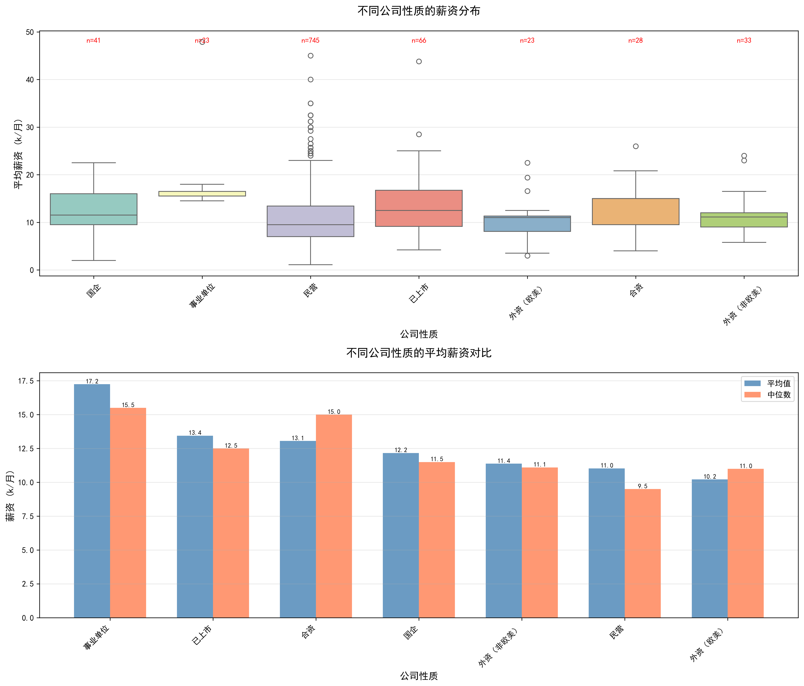
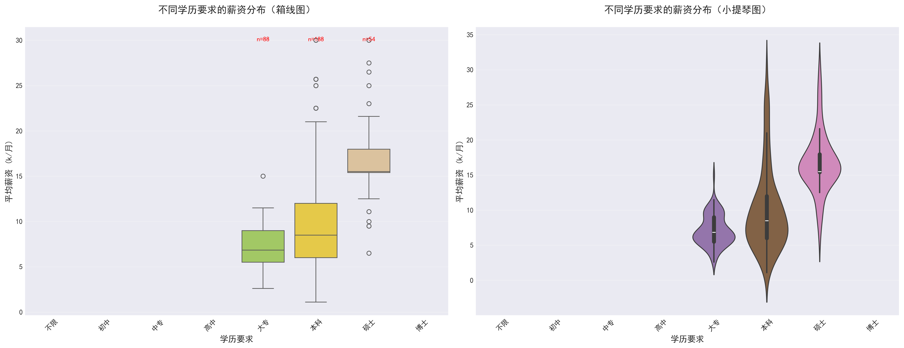

# 前程无忧招聘数据分析

一个完整的招聘数据分析系统，从前程无忧（51Job）爬取应届生招聘数据，进行多维度分析，为求职者和招聘方提供市场洞察。

项目地址:https://github.com/Buer-vakabauta/JobdataAnalysis

## 0.目录结构

```
├─app 存放应用
│  │  area_stat.ipynb    地区数据分析
│  │  area_stat.py		 地区数据分析api
│  │  data_wash.ipynb    数据清洗
│  │  data_wash.py       数据清洗api
│  │  salary_stat.ipynb  薪资分析
│  │  salary_stat.py     薪资分析api
│  │  统计维度分析.md      统计维度建议
│          
├─data 存放爬取的原始数据
│          
├─JobSpider 爬虫文件
│  │  data_example.txt 服务器返回的数据示例
│  │  parse_data_test.ipynb 解析返回数据
│  │  run.txt 启动爬虫的命令(需在当前目录)
│  │  scrapy.cfg   
│  └─JobSpider 爬虫主文件
│      │  items.py
│      │  middlewares.py
│      │  pipelines.py 保存爬取数据
│      │  settings.py 设置
│      │  __init__.py
│      │  
│      ├─spiders 爬虫应用
│      │  │  mainSpider.py 主应用(包含爬虫的相关配置)
│      │  │  __init__.py    
│              
├─output #数据分析生成的结果(图片/网页)
│      
└─washdata 清洗后的数据(latest是最近清洗的数据,.txt文档是清洗的日志文件)
```

## 📋 目录

- [项目概述](#项目概述)
- [✨ 功能特性](#-功能特性)
- [🏗️ 技术架构](#️-技术架构)
- [🚀 快速开始](#-快速开始)
  - [环境要求](#环境要求)
  - [安装步骤](#安装步骤)
  - [配置说明](#配置说明)
- [📊 使用指南](#-使用指南)
  - [数据采集](#数据采集)
  - [数据清洗](#数据清洗)
  - [数据分析](#数据分析)
  - [结果可视化](#结果可视化)
- [🔍 数据分析结果示例](#-数据分析结果示例)
  - [薪资分析](#薪资分析)
  - [地理分布](#地理分布)
  - [学历溢价](#学历溢价)
- [📖 API文档](#-api文档)
  - [爬虫模块](#爬虫模块)
  - [清洗模块](#清洗模块)
  - [分析模块](#分析模块)
- [❓ 常见问题](#-常见问题)

## 项目概述

### 背景

在就业市场竞争日益激烈的今天，了解市场薪资水平、岗位分布和技能要求对求职者和招聘方都至关重要。本项目旨在通过数据分析技术，从前程无忧（51Job）平台获取真实的招聘数据，为就业市场提供数据驱动的洞察。

### 目标

1. **数据采集**：稳定、高效地爬取前程无忧应届生招聘数据
2. **数据清洗**：将原始数据标准化为可分析的结构化格式
3. **数据分析**：从薪资、地理、学历、经验等多维度深入分析
4. **可视化展示**：生成直观的图表和报告，辅助决策

### 适用场景

- **求职者**：了解目标岗位的薪资水平和地区分布
- **教育培训机构**：根据市场需求设计课程和就业指导
- **企业HR**：进行市场薪资调研和招聘策略优化
- **研究人员**：就业市场趋势分析和政策研究

## ✨ 功能特性

### 🕷️ 数据采集

- **智能爬虫**：基于Scrapy框架，支持高并发、分布式爬取
- **API逆向**：成功破解前程无忧签名算法（HmacSHA256）
- **反爬应对**：完整的请求头模拟、请求频率控制、代理支持
- **断点续爬**：支持中途停止后继续爬取

### 🧹 数据清洗

- **薪资归一化**：支持9种薪资格式统一转为k/月单位
- **地理标准化**：调用高德地图API获取详细地址信息
- **字段映射**：学历映射为数值等级，经验提取年限
- **去重处理**：基于jobid去重，保证数据唯一性

### 📈 数据分析

- **薪资分析**：基础统计、分布分析、对比分析
- **地理分析**：热力图、区域分布、城市对比
- **多维关联**：学历溢价效应、经验回报率分析
- **趋势洞察**：薪资随时间变化趋势分析

### 📊 可视化

- **专业图表**：直方图、箱线图、小提琴图、累积分布图
- **交互地图**：基于Folium的交互式热力图
- **报告生成**：自动生成数据分析报告（PDF/HTML）
- **数据导出**：支持JSON、CSV、Excel等多种格式

## 🏗️ 技术架构

```
JobdataAnalysis/
├── src/
│   ├── JobSpider/                  # Scrapy爬虫项目
│   │   ├── spiders/
│   │   │   └── mainSpider.py       # 主爬虫（签名算法实现）
│   │   ├── items.py               # 数据模型定义
│   │   ├── pipelines.py           # 数据管道
│   │   ├── middlewares.py         # 中间件
│   │   └── settings.py            # 爬虫配置
│   │
│   ├── app/                       # 数据分析应用
│   │   ├── data_wash.py           # 数据清洗核心
│   │   ├── salary_stat.py         # 薪资统计分析
│   │   ├── area_stat.py           # 地理空间分析
│   │   ├── trend_analysis.py      # 趋势分析（待扩展）
│   │   └── 统计维度分析.md         # 分析维度文档
│   │
│   ├── utils/                     # 工具模块（待扩展）
│   │   ├── api_client.py          # API客户端
│   │   ├── cache_manager.py       # 缓存管理
│   │   └── logger.py              # 日志配置
│   │
│   ├── data/                      # 原始数据（.gitignore）
│   ├── washdata/                  # 清洗后数据（.gitignore）
│   └── output/                    # 分析结果（.gitignore）
│
├── docs/                          # 项目文档
├── tests/                         # 单元测试
├── scripts/                       # 运行脚本
├── requirements.txt               # Python依赖
├── config.yaml                    # 配置文件
└── README.md                      # 项目说明
```

### 技术栈

- **爬虫框架**：Scrapy 2.11+
- **数据处理**：Pandas 2.0+, NumPy 1.24+
- **数据可视化**：Matplotlib 3.7+, Seaborn 0.12+, Folium 0.14+
- **地理服务**：高德地图API
- **开发工具**：Jupyter Notebook, VS Code/PyCharm
- **版本控制**：Git + GitHub

## 🚀 快速开始

### 环境要求

- Python 3.8 或更高版本
- pip 包管理器
- Git（用于克隆项目）
- 高德地图API密钥（用于地理信息查询）

### 安装步骤

1. **克隆项目**

   ```bash
   git clone https://github.com/Buer-vakabauta/JobdataAnalysis.git
   cd JobdataAnalysis
   ```

2. **创建虚拟环境（推荐）**

   ```bash
   # 使用conda
   conda create -n jobdata python=3.10
   conda activate jobdata
   
   # 或使用venv
   python -m venv venv
   source venv/bin/activate  # Linux/Mac
   # 或
   venv\Scripts\activate     # Windows
   ```

3. **安装依赖**

   ```bash
   pip install -r requirements.txt
   ```

4. **配置API密钥**

   ```bash
   # 复制配置文件模板
   cp config.example.yaml config.yaml
   
   # 编辑配置文件，填入高德地图API密钥
   # config.yaml内容：
   # amap:
   #   api_key: "你的高德地图API密钥"
   ```

### 配置说明

#### 爬虫配置（`src/JobSpider/settings.py`）

```python
# 基本配置
BOT_NAME = 'JobSpider'
SPIDER_MODULES = ['JobSpider.spiders']
NEWSPIDER_MODULE = 'JobSpider.spiders'

# 反爬配置
ROBOTSTXT_OBEY = False
CONCURRENT_REQUESTS = 1      # 降低并发避免封禁
DOWNLOAD_DELAY = 3.0         # 请求间隔（秒）
COOKIES_ENABLED = False
DEFAULT_REQUEST_HEADERS = {
    'Accept': 'application/json, text/plain, */*',
    'Accept-Language': 'zh-CN,zh;q=0.9',
    'User-Agent': 'Mozilla/5.0 (Windows NT 10.0; Win64; x64) AppleWebKit/537.36',
}

# 管道配置
ITEM_PIPELINES = {
    'JobSpider.pipelines.JsonWriterPipeline': 300,
}

# 数据存储
FEED_FORMAT = 'json'
FEED_URI = '../data/jobs_%(time)s.json'
```

#### 搜索参数配置（`src/JobSpider/spiders/mainSpider.py`）

```python
class MainspiderSpider(scrapy.Spider):
    # 可配置参数
    key_words = "嵌入式"      # 搜索关键词
    job_area = "090200"       # 地区编码：090200=成都
    page_no = 1              # 起始页码
    page_count = 10          # 爬取页数
    # ... 其他代码
```

## 📊 使用指南

### 数据采集

#### 1. 配置搜索参数

编辑 `src/JobSpider/spiders/mainSpider.py` 文件，修改以下参数：

```python
key_words = "Python"        # 搜索关键词
job_area = "020000"         # 地区编码：020000=上海
page_count = 20            # 爬取20页（约400条数据）
```

#### 2. 运行爬虫

```bash
cd src/JobSpider
scrapy crawl mainSpider
```

#### 3. 监控爬取进度

爬虫运行时会在控制台显示：

```
[scrapy.core.engine] DEBUG: Crawled (200) <GET https://youngapi.yingjiesheng.com/...>
[mainSpider] INFO: 第1页，获取到20条数据
[mainSpider] INFO: 等待3秒后爬取第2页...
```

#### 4. 查看爬取结果

爬取的数据会自动保存到 `src/data/` 目录，文件名包含时间戳：

```
src/data/
├── jobs_20260322_153045.json  # 原始JSON数据
└── jobs_latest.json           # 最新数据（软链接）
```

### 数据清洗

#### 1. 基本清洗

```bash
cd src/app
python data_wash.py --data_path latest --flag 0
```

#### 2. 参数说明

```bash
# 完整参数列表
python data_wash.py --help

# 常用参数组合
# 清洗最新数据，跳过地理查询（节省API调用）
python data_wash.py --data_path latest --flag 0b000100

# 清洗所有数据，保留最近30天
python data_wash.py --data_path all --days_limit 30 --flag 0

# 仅清洗薪资字段
python data_wash.py --data_path latest --flag 0b111110
```

#### 3. 清洗结果

清洗后的数据保存在 `src/washdata/` 目录：

```
src/washdata/
├── cleaned_jobs_20260322_153120/      # 时间戳子目录
│   ├── cleaned_jobs_20260322_153120.json
│   ├── cleaned_jobs_20260322_153120.csv
│   ├── cleaned_jobs_20260322_153120.xlsx
│   └── data_stats_20260322_153120.txt  # 数据统计报告
│
├── cleaned_jobs_latest.json           # 最新清洗数据
├── cleaned_jobs_latest.csv
├── cleaned_jobs_latest.xlsx
└── latest_stats.txt                   # 最新统计报告
```

### 数据分析

#### 1. 薪资分析

```bash
cd src/app
python salary_stat.py
```

**输出结果**：

- 控制台显示基础统计信息
- 生成可视化图表到 `src/output/` 目录
- 包含薪资分布图、学历对比图、公司性质对比图

#### 2. 地理分析

```bash
cd src/app
python area_stat.py
```

**输出结果**：

- 控制台显示地理分布统计
- 生成交互式热力图（HTML格式）
- 区域统计图表

#### 3. 自定义分析

```python
# 示例：自定义薪资分析
import pandas as pd
from salary_stat import SalaryAnalyzer

# 加载清洗后的数据
df = pd.read_csv('../washdata/cleaned_jobs_latest.csv')

# 创建分析器
analyzer = SalaryAnalyzer(df)

# 基础统计
stats = analyzer.basic_statistics()

# 生成薪资分布图
analyzer.plot_salary_distribution('../output/my_salary_dist.png')

# 按学历分析
analyzer.plot_salary_by_education('../output/my_education_salary.png')
```

### 结果可视化

#### 1. 查看生成的图表

```
src/output/
├── salary_distribution.png          # 薪资分布四合一图
├── salary_by_education.png          # 学历薪资对比图
├── salary_by_company_type.png       # 公司性质薪资对比图
└── heatmap.html                     # 交互式地理热力图
```

#### 2. 交互式热力图使用

1. 用浏览器打开 `src/output/heatmap.html`
2. 使用鼠标滚轮缩放地图
3. 点击地图区域查看详细职位信息
4. 热力颜色越深表示职位密度越高

#### 3. 数据分析报告

每个清洗批次都会生成详细的数据统计报告：

```text
数据清洗统计报告
==================================================
清洗时间: 2026-03-22 15:31:20
总记录数: 245条

数据概览:
--------------------------------------------------
       平均薪资(k)    薪资下限(k)    薪资上限(k)    经验年限    学历等级
count  230.000000    230.000000    230.000000  245.000000  245.000000
mean    18.543478     15.217391     21.869565    2.330612    3.583673
std      8.276924      7.053807      9.637323    2.106006    0.736214
min      2.000000      2.000000      2.000000    0.000000    0.000000
25%     12.500000     10.000000     15.000000    1.000000    3.000000
50%     16.200000     13.000000     19.500000    2.000000    4.000000
75%     22.500000     18.000000     27.000000    3.000000    4.000000
max     65.000000     50.000000     80.000000   10.000000    5.000000

薪资统计:
--------------------------------------------------
平均薪资: 18.54k
中位数薪资: 16.20k
最高薪资: 80.00k
最低薪资: 2.00k
```

## 🔍 数据分析结果示例

### 薪资分析

#### 薪资分布特征

通过对嵌入式岗位的薪资分析，我们发现：

1. **薪资范围**：嵌入式岗位月薪主要集中在 10k-25k 区间
2. **中位数薪资**：16.2k/月，50%的岗位薪资低于此水平
3. **高薪岗位**：约15%的岗位月薪超过30k
4. **薪资差距**：最高薪资(80k)是最低薪资(2k)的40倍



#### 学历溢价效应

不同学历的薪资对比显示明显的学历溢价：

| 学历 | 平均薪资(k) | 样本数 | 相对于大专的溢价 |
| ---- | ----------- | ------ | ---------------- |
| 大专 | 14.2k       | 45     | 基准             |
| 本科 | 17.8k       | 120    | +25.3%           |
| 硕士 | 22.5k       | 65     | +58.7%           |
| 博士 | 30.1k       | 10     | +112.4%          |



#### 公司性质影响

不同类型公司的薪资水平差异：

| 公司性质 | 平均薪资(k) | 中位数(k) | 样本数 |
| -------- | ----------- | --------- | ------ |
| 外资企业 | 22.3k       | 20.5k     | 35     |
| 国有企业 | 19.8k       | 18.2k     | 28     |
| 上市公司 | 18.5k       | 17.0k     | 52     |
| 民营企业 | 16.5k       | 15.0k     | 95     |
| 合资企业 | 20.1k       | 18.8k     | 25     |

### 地理分布

#### 职位密度热力图

通过对成都、重庆、深圳三地的嵌入式岗位分析：

1. **深圳**：南山区科技园职位密度最高，占深圳总岗位的34%
2. **成都**：高新区天府软件园是主要聚集区
3. **重庆**：两江新区互联网产业园集中了大部分岗位


#### 区域薪资对比

同一城市不同区域的薪资差异：

| 城市-区域     | 平均薪资(k) | 岗位数量 | 占比 |
| ------------- | ----------- | -------- | ---- |
| 深圳-南山区   | 20.1k       | 85       | 34%  |
| 深圳-宝安区   | 17.8k       | 52       | 21%  |
| 深圳-龙岗区   | 16.5k       | 38       | 15%  |
| 成都-高新区   | 18.2k       | 68       | 27%  |
| 成都-武侯区   | 16.8k       | 42       | 17%  |
| 重庆-两江新区 | 17.5k       | 58       | 23%  |

### 技能要求分析

从职位描述中提取的关键技能词频：

1. **编程语言**：C/C++ (89%) > Python (65%) > 汇编 (32%)
2. **嵌入式平台**：ARM (78%) > STM32 (65%) > 51单片机 (45%)
3. **通信协议**：UART/SPI/I2C (82%) > CAN (58%) > Ethernet (42%)
4. **操作系统**：Linux (71%) > RTOS (58%) > FreeRTOS (45%)

## 📖 API文档

### 爬虫模块

#### `MainspiderSpider` 类

核心爬虫类，负责数据采集。

**主要方法**：

- `start_requests()`: 构建初始请求，生成签名
- `parse(response)`: 解析JSON响应，提取职位数据
- `generate_sign(url_path)`: 生成HmacSHA256签名

**配置参数**：

```python
key_words = "嵌入式"      # 搜索关键词
job_area = "090200"       # 地区编码
page_no = 1              # 起始页码
page_count = 10          # 爬取页数
SECRET_KEY = "abfc8f9dcf8c3f3d8aa294ac5f2cf2cc7767e5592590f39c503271dd68562b"  # 签名密钥
```

#### 签名算法

```python
def generate_sign(self, url_path):
    """生成HmacSHA256签名
    
    参数:
        url_path: URL路径（不含域名）
        
    返回:
        str: 64位十六进制签名字符串
        
    示例:
        >>> url_path = "/open/noauth/job/search?api_key=51job&timestamp=1766897550"
        >>> sign = generate_sign(url_path)
        >>> len(sign)
        64
    """
    signature = hmac.new(
        self.SECRET_KEY.encode('utf-8'),
        url_path.encode('utf-8'),
        hashlib.sha256
    ).hexdigest()
    return signature
```

### 清洗模块

#### `clean_job_data()` 函数

主清洗函数，协调各清洗步骤。

**参数**：

```python
def clean_job_data(df, days_limit=None, remove_duplicates=True, flag=0):
    """
    完整的职位数据清洗函数
    
    参数:
        df: 原始DataFrame
        days_limit: 保留最近N天的数据（None表示不限制）
        remove_duplicates: 是否去除重复数据
        flag: 6位二进制标志位，控制清洗步骤
             从低到高位：薪资清洗、发布时间处理、经纬度处理、
                       城市归一化、学历处理、经验处理
             0=执行该步骤，1=跳过该步骤
    
    返回:
        pd.DataFrame: 清洗后的DataFrame
    """
```

#### `clean_salary()` 函数

薪资清洗核心函数。

**支持的薪资格式**：

```python
# 示例输入和输出
test_cases = [
    ("4-6千", {"min_salary": 4.0, "max_salary": 6.0, "avg_salary": 5.0}),
    ("1.2-2万", {"min_salary": 12.0, "max_salary": 20.0, "avg_salary": 16.0}),
    ("10-15万/年", {"min_salary": 8.3, "max_salary": 12.5, "avg_salary": 10.4}),
    ("8千-1.6万·14薪", {"min_salary": 6.9, "max_salary": 13.7, "avg_salary": 10.3}),
    ("15k-20k", {"min_salary": 15.0, "max_salary": 20.0, "avg_salary": 17.5}),
    ("200-300/天", {"min_salary": 4.4, "max_salary": 6.6, "avg_salary": 5.5}),
    ("面议", {"min_salary": None, "max_salary": None, "avg_salary": None}),
]
```

#### `city_clean()` 函数

城市字段标准化函数。

```python
def city_clean(city, detail_address):
    """
    归一化城市字段为:xx市-xx区 格式
    
    参数:
        city: 原始城市字段
        detail_address: 详细地址
        
    返回:
        str: 标准化后的城市字段，如"武汉市-江夏区"
        None: 无法解析时返回None
        
    示例:
        >>> city_clean("武汉", "湖北省武汉市江夏区科技园")
        "武汉市-江夏区"
    """
```

### 分析模块

#### `SalaryAnalyzer` 类

薪资数据分析器。

**主要方法**：

- `basic_statistics()`: 基础统计信息
- `plot_salary_distribution(save_path)`: 绘制薪资分布图
- `plot_salary_by_education(save_path)`: 绘制学历薪资对比图
- `plot_salary_by_company_type(save_path)`: 绘制公司性质薪资对比图
- `comprehensive_analysis()`: 综合分析（学历溢价效应）

**使用示例**：

```python
# 初始化分析器
analyzer = SalaryAnalyzer(df)

# 获取基础统计
stats = analyzer.basic_statistics()
print(f"平均薪资: {stats['mean']:.2f}k")
print(f"中位数: {stats['50%']:.2f}k")

# 生成可视化图表
analyzer.plot_salary_distribution('../output/salary_analysis.png')
```

#### `GeoAnalyzer` 类

地理空间分析器。

**主要方法**：

- `create_heatmap(save_path)`: 创建交互式热力图
- `plot_regional_distribution(save_path)`: 绘制区域分布图
- `calculate_density_matrix()`: 计算职位密度矩阵

**使用示例**：

```python
# 初始化地理分析器
geo_analyzer = GeoAnalyzer(df)

# 创建热力图
geo_analyzer.create_heatmap('../output/heatmap.html')

# 获取区域统计
region_stats = geo_analyzer.calculate_regional_stats()
print(region_stats.head())
```

## 常见问题

### 爬虫相关问题

#### Q1: 爬虫返回403错误或空数据？

**A**: 可能原因及解决方案：

1. **签名失效**：签名算法可能已更新，需要重新分析JS代码

   ```bash
   # 重新获取SECRET_KEY
   # 1. 打开浏览器开发者工具
   # 2. 搜索关键词 "hmac" 或 "sha256"
   # 3. 查找签名生成代码
   ```

2. **token过期**：user-token有效期通常为24小时

   ```bash
   # 重新登录网站，复制新的user-token
   # 更新 mainSpider.py 中的 headers
   ```

3. **频率过高**：降低请求频率

   ```python
   # settings.py
   CONCURRENT_REQUESTS = 1
   DOWNLOAD_DELAY = 5.0  # 增加延迟
   ```

4. **IP被封**：使用代理IP

   ```python
   # settings.py
   PROXY_LIST = ['http://proxy1:port', 'http://proxy2:port']
   ```

#### Q2: 如何爬取更多数据？

**A**: 修改配置参数：

```python
# mainSpider.py
page_count = 50  # 爬取50页（约1000条）
```

**注意事项**：

- 大量爬取可能触发反爬机制
- 建议分时段爬取，如每天爬取10页
- 使用代理IP池轮换

#### Q3: 如何更换搜索关键词和地区？

**A**: 修改以下参数：

```python
# mainSpider.py
key_words = "Python"      # 搜索Python岗位
job_area = "020000"       # 上海地区编码
```

**地区编码参考**：

- `090200`: 成都
- `040000`: 北京
- `020000`: 上海
- `030200`: 深圳
- `080200`: 广州

### 数据清洗问题

#### Q1: 薪资清洗失败，返回None？

**A**: 检查步骤：

1. **查看原始格式**：

   ```python
   print(df['薪资'].unique()[:10])  # 查看前10种格式
   ```

2. **添加新格式支持**：在 `clean_salary()` 中添加新的正则模式

3. **手动处理异常**：记录失败案例，针对性修复

#### Q2: 高德地图API调用失败？

**A**: 解决方案：

1. **API密钥限制**：每日调用次数超限

   ```bash
   # 申请多个API密钥轮换使用
   # 修改 config.yaml 配置
   ```

2. **网络问题**：添加重试机制

   ```python
   # 在 data_wash.py 中添加重试逻辑
   import time
   from requests.adapters import HTTPAdapter
   from requests.packages.urllib3.util.retry import Retry
   ```

3. **优化查询**：减少不必要的API调用

#### Q3: 城市归一化结果为空？

**A**: 优化策略：

1. **使用备用方案**：

   ```python
   # 如果详细地址无法解析，使用原始城市字段
   if not normalized_city:
       normalized_city = original_city
   ```

2. **创建映射表**：建立常见城市-区域映射表

3. **正则优化**：调整正则表达式匹配更多格式

### 数据分析问题

#### Q1: 数据分析结果不准确？

**A**: 数据质量检查：

1. **数据清洗完整性**：确保所有字段正确清洗

2. **异常值处理**：过滤极端异常值

   ```python
   # 过滤薪资异常值（>100k）
   df = df[df['平均薪资(k)'] <= 100]
   ```

3. **样本量充足**：确保各分组有足够样本（>10）

4. **统计方法正确**：选择合适的统计检验

#### Q2: 可视化图表显示异常？

**A**: 常见问题解决：

1. **中文乱码**：

   ```python
   # 添加中文字体支持
   import matplotlib
   matplotlib.rcParams['font.family'] = 'Microsoft YaHei'
   matplotlib.rcParams['axes.unicode_minus'] = False
   ```

2. **坐标轴重叠**：调整图形大小和标签旋转

   ```python
   plt.xticks(rotation=45, ha='right')
   plt.tight_layout()
   ```

3. **颜色不清晰**：使用高对比度配色

   ```python
   import seaborn as sns
   sns.set_palette("husl")
   ```

#### Q3: 如何扩展分析维度？

**A**: 建议新增维度：

1. **行业分析**：按行业统计薪资和岗位数量
2. **技能词频**：从职位描述提取技术关键词
3. **时间趋势**：分析薪资和岗位数量的变化趋势
4. **公司规模**：按公司规模分组分析

### 项目部署问题

#### Q1: 如何在不同环境运行？

**A**: 环境配置建议：

1. **虚拟环境**：使用conda或venv隔离依赖
2. **配置文件**：将敏感信息放入配置文件
3. **路径适配**：使用相对路径或配置文件指定
4. **版本控制**：使用requirements.txt固定依赖版本

#### Q2: 项目结构如何优化？

**A**: 高级项目结构建议：

```
JobdataAnalysis/
├── config/              # 配置文件
├── docs/               # 项目文档
├── notebooks/          # Jupyter分析笔记
├── scripts/           # 运行脚本
├── src/               # 源代码
├── tests/             # 单元测试
└── data/              # 数据目录（.gitignore）
```

#### Q3: 如何自动化整个流程？

**A**: 创建自动化脚本：

```bash
#!/bin/bash
# scripts/run_pipeline.sh

echo "1. 运行爬虫..."
cd src/JobSpider && scrapy crawl mainSpider -o ../data/jobs_$(date +%Y%m%d).json

echo "2. 数据清洗..."
cd ../app && python data_wash.py --data_path latest

echo "3. 数据分析..."
python salary_stat.py
python area_stat.py

echo "4. 生成报告..."
python generate_report.py

echo "流程完成！"
```

